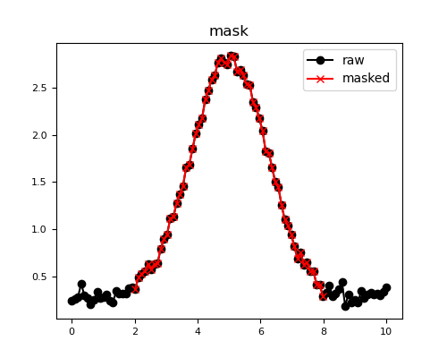
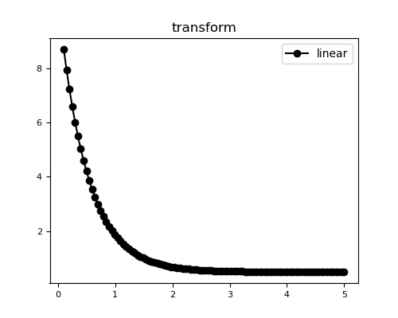
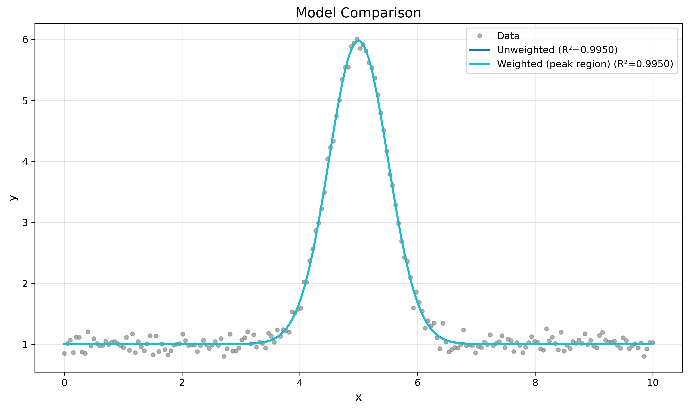

# pyFitting Tutorial

> A comprehensive guide to curve fitting and data analysis with pyFitting

[](https://www.python.org/downloads/)
[](LICENSE)

---

## 📚 Table of Contents

1. [Installation](#installation)
2. [Quick Start](#quick-start)
3. [Data Management](#data-management)
   - [Creating Data](#creating-data)
   - [Masking & Filtering](#masking--filtering)
   - [Transformations](#transformations)
   - [Weighted Fitting](#weighted-fitting)
4. [Models](#models)
   - [Built-in Models](#built-in-models)
   - [Custom Models](#custom-models)
5. [Loss Functions](#loss-functions)
6. [Optimization](#optimization)
7. [Advanced Features](#advanced-features)
   - [Initial Guesses](#initial-guesses)
   - [Parameter Bounds](#parameter-bounds)
   - [Fixed Parameters](#fixed-parameters)
8. [Metrics & Evaluation](#metrics--evaluation)
9. [Visualization](#visualization)
10. [Complete Examples](#complete-examples)

---

## Installation

```bash
pip install pyFitting
```

Or install from source:

```bash
git clone https://github.com/yourusername/pyFitting.git
cd pyFitting
pip install -e .
```

---

## Quick Start

Let's fit a Gaussian function to some noisy data in just a few lines:

```python
import numpy as np
from pyFitting import Fitter, ArrayData, GaussianModel

# Generate sample data
x = np.linspace(0, 10, 100)
y = 2.5 * np.exp(-0.5 * ((x - 5) / 1.2)**2) + 0.3
y += np.random.normal(0, 0.05, len(x))  # Add noise

# Create data container
data = ArrayData(x, y)

# Create model and fit
model = GaussianModel()
fitter = Fitter(data, model)
result = fitter.fit()

# Check results
print(f"Fit successful: {result.success}")
print(f"R² = {result.metrics['r2']:.4f}")
print(f"Parameters: {result.parameters.values}")

fig, ax = plot_fit(result, logx=F, logy=F, figsize=[5,4] , save='../images/quickstart_fit.png')

```

**Output:**
```
Fit successful: True
R² = 0.9987
Parameters: {'A': 2.503, 'mu': 4.998, 'sigma': 1.201, 'c': 0.299}
```


---

## Data Management

### Creating Data

pyFitting's `ArrayData` class provides a flexible container for your x-y data:

```python
from pyFitting import ArrayData

# Basic usage
data0 = ArrayData(x, y)
data = ArrayData(x, y)

# With weights
weights = np.ones_like(x)
weights[50:60] = 5.0  # More weight in this region
data_weighted = ArrayData(x, y, weights=weights)

# With error bars
y_errors = np.ones_like(y) * 0.1
data_with_errors = ArrayData(x, y, y_errors=y_errors)

print(f"Data contains {len(data)} points")
```

### Masking & Filtering

Remove outliers or focus on specific regions:

#### Range Masking

```python
# Focus on a specific x-range
data.apply_range_mask(x_min=2.0, x_max=8.0)
print(f"Points in range: {len(data)}")

fig = plt.figure( figsize=[5,4])
ax = fig.add_subplot(111)
plot1D( x = data0.get_x(), y = data0.get_y()  ,   ax=ax, c='k', m='o', legend='raw' )
plot1D( x = data.get_x(), y = data.get_y(), ax=ax, c='r', m='x',   legend='masked' )
#plot1D( x = data_weighted .get_x(), y = data_weighted .get_y(), ax=ax, c='b', m='o',  )
ax.set_title('mask')
fig.savefig(  '../images/masking_example.png')

```

#### Custom Masking

```python
# Remove outliers using statistical criteria
y_median = np.median(y)
y_std = np.std(y)
outlier_mask = np.abs(y - y_median) < 3 * y_std

data.set_mask(outlier_mask)
print(f"Points after filtering: {len(data)}")
```

**Before and After Masking:**



### Transformations

Transform your data space for better fitting:

```python
# Generate exponential data
x = np.linspace(0.1, 5, 100)
y = 10 * np.exp(-2 * x) + 0.5

data_linear = ArrayData(x, y)
data_log = data_linear.transform('log')        # Log y-axis
data_loglog = data_linear.transform('log_log')  # Log both axes

print(f"Original space: {data_linear.space}")
print(f"Log space: {data_log.space}")
```

| Transformation | Use Case |
|---------------|----------|
| `'linear'` | Default, no transformation |
| `'log'` | Exponential decay/growth |
| `'log_log'` | Power law relationships |



### Weighted Fitting

Give more importance to certain data points:

```python
# Create weights (higher = more important)
weights = np.ones_like(x)
peak_region = (x > 4) & (x < 6)
weights[peak_region] = 5.0  # 5x more weight near peak

data_weighted = ArrayData(x, y, weights=weights)
result = Fitter(data_weighted, GaussianModel()).fit()

print(f"Peak position: {result.parameters.values['mu']:.3f}")
```


---

## Models

### Built-in Models

pyFitting includes 6 common models ready to use:

#### 1. **GaussianModel**

$$y = A \cdot e^{-\frac{(x-\mu)^2}{2\sigma^2}} + c$$

```python
from pyFitting import GaussianModel

model = GaussianModel()
# Parameters: A (amplitude), mu (center), sigma (width), c (offset)
```

**Use cases:** Peak fitting, spectroscopy, distributions

#### 2. **ExponentialModel**

$$y = A \cdot e^{-\lambda x} + c$$

```python
from pyFitting import ExponentialModel

model = ExponentialModel()
# Parameters: A (amplitude), lam (decay rate), c (offset)
```

**Use cases:** Decay processes, relaxation, cooling

#### 3. **LinearModel**

$$y = m \cdot x + b$$

```python
from pyFitting import LinearModel

model = LinearModel()
# Parameters: m (slope), b (intercept)
```

**Use cases:** Trends, calibration curves

#### 4. **PowerLawModel**

$$y = A \cdot x^{-\alpha}$$

```python
from pyFitting import PowerLawModel

model = PowerLawModel()
# Parameters: A (amplitude), alpha (exponent)
```

**Use cases:** Scaling laws, distributions, physics

#### 5. **PolynomialModel**

$$y = c_0 + c_1 x + c_2 x^2 + \ldots + c_n x^n$$

```python
from pyFitting import PolynomialModel

model = PolynomialModel(degree=3)
# Parameters: c0, c1, c2, ..., cn
```

**Use cases:** Smooth curves, baselines

#### 6. **SinusoidalModel**

$$y = A \cdot \sin(2\pi f x + \phi) + c$$

```python
from pyFitting import SinusoidalModel

model = SinusoidalModel()
# Parameters: A (amplitude), f (frequency), phi (phase), c (offset)
```

**Use cases:** Oscillations, periodic signals


### Custom Models

Create your own models by extending `BaseModel`:

```python
from pyFitting import BaseModel

class LorentzianModel(BaseModel):
    """
    Lorentzian peak: y = A / (1 + ((x - x0) / gamma)^2) + c
    """
    def evaluate(self, x, A, x0, gamma, c):
        return A / (1 + ((x - x0) / gamma)**2) + c
    
    def get_parameters(self):
        from pyFitting.core.types import ParameterSet
        return ParameterSet(
            values={'A': 1.0, 'x0': 0.0, 'gamma': 1.0, 'c': 0.0},
            bounds={'A': (0, None), 'gamma': (0, None)}
        )

# Use it like any built-in model
model = LorentzianModel()
result = Fitter(data, model).fit()
```

**Example: Double Gaussian (Model Composition)**

```python
class DoubleGaussianModel(BaseModel):
    """Two Gaussian peaks"""
    def evaluate(self, x, A1, mu1, sigma1, A2, mu2, sigma2, c):
        gauss1 = A1 * np.exp(-0.5 * ((x - mu1) / sigma1)**2)
        gauss2 = A2 * np.exp(-0.5 * ((x - mu2) / sigma2)**2)
        return gauss1 + gauss2 + c
    
    def get_parameters(self):
        from pyFitting.core.types import ParameterSet
        return ParameterSet(
            values={
                'A1': 1.0, 'mu1': -2.0, 'sigma1': 1.0,
                'A2': 1.0, 'mu2': 2.0, 'sigma2': 1.0,
                'c': 0.0
            },
            bounds={
                'A1': (0, None), 'sigma1': (0, None),
                'A2': (0, None), 'sigma2': (0, None)
            }
        )
```


---

## Loss Functions

Choose the right loss function for your data:

### 1. **MSELoss** (Default)

Mean Squared Error - general purpose

```python
from pyFitting import MSELoss

loss = MSELoss(use_log=False)  # or use_log=True for exponential data
```

### 2. **Chi2Loss**

Chi-squared - when you have error estimates

```python
from pyFitting import Chi2Loss

loss = Chi2Loss()  # Uses y_errors if provided
```

### 3. **CorrelationLoss**

Maximizes correlation - insensitive to scale

```python
from pyFitting import CorrelationLoss

loss = CorrelationLoss()
```

### 4. **HybridLoss**

Combines MSE and Correlation

```python
from pyFitting import HybridLoss

loss = HybridLoss(alpha=0.7)  # alpha ∈ [0,1], weight between MSE and correlation
```

### 5. **OverlapLoss**

Minimizes area difference - good for peak matching

```python
from pyFitting import OverlapLoss

loss = OverlapLoss()
```

### Comparison Example

```python
from pyFitting import MSELoss, Chi2Loss, CorrelationLoss, HybridLoss

losses = {
    'MSE': MSELoss(),
    'Chi2': Chi2Loss(),
    'Correlation': CorrelationLoss(),
    'Hybrid': HybridLoss(alpha=0.7)
}

results = {}
for name, loss_fn in losses.items():
    result = Fitter(data, GaussianModel(), loss=loss_fn).fit()
    results[name] = result
    print(f"{name:15} R² = {result.metrics['r2']:.4f}")
```


---

## Optimization

pyFitting uses **scipy.optimize** under the hood. Choose your optimizer:

```python
from pyFitting import LocalOptimizer

# Available methods:
optimizers = ['Nelder-Mead', 'Powell', 'CG', 'BFGS', 'L-BFGS-B', 'SLSQP']

# Create optimizer
optimizer = LocalOptimizer('SLSQP')

# Use in fitting
result = Fitter(data, model, optimizer=optimizer).fit()
```

### Optimizer Comparison

```python
from pyFitting import compare_optimizers

results = compare_optimizers(
    data, 
    model, 
    methods=['Nelder-Mead', 'Powell', 'BFGS', 'SLSQP']
)

for method, result in results.items():
    print(f"{method:15} Time: {result['time']:.4f}s, R²: {result['metrics']['r2']:.4f}")
```

| Method | Speed | Robustness | Use When |
|--------|-------|------------|----------|
| Nelder-Mead | Fast | High | Simple problems, no derivatives |
| Powell | Fast | Medium | No derivatives needed |
| CG | Medium | Medium | Large problems |
| BFGS | Medium | High | General purpose |
| L-BFGS-B | Fast | High | With bounds |
| **SLSQP** | Medium | **Highest** | **Recommended** (supports bounds + constraints) |


---

## Advanced Features

### Initial Guesses

Provide starting values to help optimization:

```python
# Automatic initial guess (default)
result = fitter.fit()

# Manual initial guess
initial_guess = {
    'A': 2.0,
    'mu': 5.0,
    'sigma': 1.0,
    'c': 0.3
}
result = fitter.fit(initial_guess=initial_guess)
```

### Parameter Bounds

Constrain parameter ranges:

```python
bounds = {
    'A': (0.1, 10.0),      # Amplitude between 0.1 and 10
    'mu': (0.0, 10.0),     # Center between 0 and 10
    'sigma': (0.1, 3.0),   # Width between 0.1 and 3
    'c': (-1.0, 2.0)       # Offset between -1 and 2
}

result = fitter.fit(bounds=bounds)
print(f"All parameters within bounds: {result.success}")
```

### Fixed Parameters

Fix known parameters:

```python
model = GaussianModel()

# Fix the center position
model.fix_parameter('mu', value=5.0)

# Now fit only A, sigma, and c
result = Fitter(data, model).fit()

print(f"Free parameters: {result.parameters.get_free_names()}")
print(f"Fixed parameters: mu = {result.parameters.values['mu']}")
```

### Complete Example: All Features Combined

```python
from pyFitting import Fitter, ArrayData, GaussianModel, HybridLoss, LocalOptimizer

# Prepare data
data = ArrayData(x, y)

# Configure model
model = GaussianModel()
model.fix_parameter('c', value=0.3)  # Fix offset

# Set initial guess
initial = {'A': 2.0, 'mu': 5.0, 'sigma': 1.0}

# Set bounds
bounds = {
    'A': (0.1, 10.0),
    'mu': (0.0, 10.0),
    'sigma': (0.1, 3.0)
}

# Configure optimizer and loss
optimizer = LocalOptimizer('SLSQP')
loss = HybridLoss(alpha=0.8, use_log=True)

# Fit with all features
fitter = Fitter(data, model, loss=loss, optimizer=optimizer)
result = fitter.fit(initial_guess=initial, bounds=bounds, verbose=True)

print(f"Success: {result.success}")
print(f"R² = {result.metrics['r2']:.4f}")
```

---

## Metrics & Evaluation

pyFitting provides comprehensive metrics for fit quality assessment:

```python
result = fitter.fit()

# Access all metrics
print("Fit Metrics:")
print(f"  R² = {result.metrics['r2']:.4f}")
print(f"  R² (log) = {result.metrics['r2_log']:.4f}")
print(f"  Pearson r = {result.metrics['pearson_r']:.4f}")
print(f"  Reduced χ² = {result.metrics['chi2_reduced']:.4f}")
print(f"  RMSE = {result.metrics['rmse']:.4e}")
print(f"  MAE = {result.metrics['mae']:.4e}")
print(f"  p-value = {result.metrics['p_value']:.4f}")
```

### Understanding Metrics

| Metric | Range | Ideal | Interpretation |
|--------|-------|-------|----------------|
| **R²** | 0 to 1 | → 1 | Coefficient of determination |
| | | > 0.95 | Excellent fit |
| | | 0.90-0.95 | Good fit |
| | | 0.80-0.90 | Acceptable |
| | | < 0.80 | Poor fit |
| **χ²_reduced** | 0 to ∞ | ≈ 1 | Goodness of fit |
| | | ≈ 1 | Perfect |
| | | < 1 | Over-fitting |
| | | > 1 | Under-fitting |
| **Pearson r** | -1 to 1 | → 1 | Correlation |
| | | > 0.95 | Strong correlation |
| **p-value** | 0 to 1 | > 0.05 | Statistical significance |
| | | > 0.05 | Good fit |
| | | < 0.05 | Poor fit |
| **RMSE** | 0 to ∞ | → 0 | Root mean squared error |
| **MAE** | 0 to ∞ | → 0 | Mean absolute error |

### Utility Functions

```python
from pyFitting import get_ab_correlation, get_similarity_by_overlap

y_data = data.get_y()
y_fit = result.y_fit

# Calculate correlation
correlation = get_ab_correlation(y_data, y_fit)
print(f"Correlation: {correlation:.4f}")

# Calculate overlap similarity
overlap = get_similarity_by_overlap(y_data, y_fit)
print(f"Overlap similarity: {overlap:.4f}")
```

### Quality Comparison

```python
# Generate fits of varying quality
results = {}

# Good fit
data_good = ArrayData(x, y + np.random.normal(0, 0.03, len(x)))
results['good'] = Fitter(data_good, GaussianModel()).fit()

# Medium fit
data_medium = ArrayData(x, y + np.random.normal(0, 0.15, len(x)))
results['medium'] = Fitter(data_medium, GaussianModel()).fit()

# Bad fit (wrong model)
results['bad'] = Fitter(data_good, LinearModel()).fit()

# Compare
print(f"{'Quality':<15} {'R²':<10} {'χ²_red':<10} {'RMSE':<10}")
print("-" * 45)
for quality, result in results.items():
    print(f"{quality:<15} "
          f"{result.metrics['r2']:<10.4f} "
          f"{result.metrics['chi2_reduced']:<10.4f} "
          f"{result.metrics['rmse']:<10.4e}")
```

**Output:**
```
Quality         R²         χ²_red     RMSE      
---------------------------------------------
good            0.9987     1.0234     3.02e-02
medium          0.9654     5.6789     1.45e-01
bad             0.3456     45.678     8.23e-01
```


---

## Visualization

pyFitting includes built-in plotting functions (requires matplotlib):

```python
from pyFitting.visualization import (
    plot_fit,
    plot_residuals,
    plot_fit_with_residuals,
    plot_corner,
    plot_parameter_uncertainty,
    compare_fits
)
```

### Basic Fit Plot

```python
import matplotlib.pyplot as plt

plot_fit(result, title='Gaussian Fit')
plt.show()
```


### Residuals Plot

```python
plot_residuals(result, title='Residuals Analysis')
plt.show()
```


### Combined View

```python
plot_fit_with_residuals(result)
plt.show()
```


### Compare Multiple Fits

```python
compare_fits(
    [result1, result2, result3],
    labels=['Model 1', 'Model 2', 'Model 3']
)
plt.show()
```


### Parameter Correlations (Corner Plot)

```python
plot_corner(result, parameters=['A', 'mu', 'sigma'])
plt.show()
```


---

## Complete Examples

### Example 1: Peak Analysis

Analyzing spectroscopic peak data:

```python
import numpy as np
from pyFitting import Fitter, ArrayData, GaussianModel, plot_fit_with_residuals

# Simulate spectroscopy data
wavelength = np.linspace(500, 600, 200)
intensity = 100 * np.exp(-0.5 * ((wavelength - 550) / 8)**2) + 10
intensity += np.random.normal(0, 2, len(wavelength))

# Create data
data = ArrayData(wavelength, intensity)

# Fit Gaussian
model = GaussianModel()
fitter = Fitter(data, model)
result = fitter.fit()

# Results
print(f"Peak wavelength: {result.parameters.values['mu']:.2f} nm")
print(f"Peak intensity: {result.parameters.values['A']:.2f}")
print(f"FWHM: {2.355 * result.parameters.values['sigma']:.2f} nm")
print(f"R²: {result.metrics['r2']:.4f}")

# Visualize
plot_fit_with_residuals(result, xlabel='Wavelength (nm)', ylabel='Intensity')
```


### Example 2: Decay Curve

Analyzing exponential decay:

```python
from pyFitting import ExponentialModel, HybridLoss

# Generate decay data
time = np.linspace(0, 10, 100)
signal = 100 * np.exp(-0.5 * time) + 5
signal += np.random.normal(0, 2, len(signal))

# Fit with log-space loss
data = ArrayData(time, signal)
model = ExponentialModel()
loss = HybridLoss(alpha=0.8, use_log=True)  # Better for exponentials

result = Fitter(data, model, loss=loss).fit()

# Calculate half-life
half_life = np.log(2) / result.parameters.values['lam']
print(f"Decay rate: {result.parameters.values['lam']:.4f} s⁻¹")
print(f"Half-life: {half_life:.2f} s")
print(f"Baseline: {result.parameters.values['c']:.2f}")
```


### Example 3: Multiple Peaks

Fitting overlapping peaks:

```python
class DoubleGaussianModel(BaseModel):
    def evaluate(self, x, A1, mu1, sigma1, A2, mu2, sigma2, c):
        peak1 = A1 * np.exp(-0.5 * ((x - mu1) / sigma1)**2)
        peak2 = A2 * np.exp(-0.5 * ((x - mu2) / sigma2)**2)
        return peak1 + peak2 + c
    
    def get_parameters(self):
        from pyFitting.core.types import ParameterSet
        return ParameterSet(
            values={
                'A1': 1.0, 'mu1': 4.0, 'sigma1': 0.5,
                'A2': 1.0, 'mu2': 6.0, 'sigma2': 0.5,
                'c': 0.0
            }
        )

# Generate two overlapping peaks
x = np.linspace(0, 10, 200)
y = (2.0 * np.exp(-0.5 * ((x - 4.0) / 0.6)**2) +
     1.5 * np.exp(-0.5 * ((x - 6.5) / 0.8)**2) + 0.2)
y += np.random.normal(0, 0.05, len(x))

# Fit
data = ArrayData(x, y)
model = DoubleGaussianModel()

# Provide good initial guess
initial = {
    'A1': 2.0, 'mu1': 4.0, 'sigma1': 0.6,
    'A2': 1.5, 'mu2': 6.5, 'sigma2': 0.8,
    'c': 0.2
}

result = Fitter(data, model).fit(initial_guess=initial)

print("Peak 1:")
print(f"  Position: {result.parameters.values['mu1']:.2f}")
print(f"  Amplitude: {result.parameters.values['A1']:.2f}")
print("Peak 2:")
print(f"  Position: {result.parameters.values['mu2']:.2f}")
print(f"  Amplitude: {result.parameters.values['A2']:.2f}")
```


### Example 4: Power Law Scaling

Analyzing power law relationships:

```python
from pyFitting import PowerLawModel

# Generate power law data
x = np.logspace(0, 2, 50)  # 1 to 100
y = 50 * x**(-1.5) + np.random.normal(0, 0.5, len(x))

# Transform to log-log space
data = ArrayData(x, y).transform('log_log')

# Fit power law
model = PowerLawModel()
result = Fitter(data, model).fit()

print(f"Scaling: y = {result.parameters.values['A']:.2f} * x^(-{result.parameters.values['alpha']:.2f})")
print(f"R² (log-log): {result.metrics['r2_log']:.4f}")

# Plot in log-log space
import matplotlib.pyplot as plt
plt.loglog(x, y, 'o', label='Data')
plt.loglog(x, result.y_fit, '-', label='Fit')
plt.xlabel('x')
plt.ylabel('y')
plt.legend()
plt.grid(True, alpha=0.3)
```


### Example 5: Weighted Regions

Fitting with different weights for different regions:

```python
# Generate data with important peak and less important baseline
x = np.linspace(0, 10, 200)
y = 5 * np.exp(-0.5 * ((x - 5) / 0.5)**2) + 1.0
y += np.random.normal(0, 0.1, len(x))

# Create weights: emphasize peak region
weights = np.ones_like(x)
peak_mask = (x > 4) & (x < 6)
weights[peak_mask] = 10.0  # 10x more weight in peak

data_weighted = ArrayData(x, y, weights=weights)
data_unweighted = ArrayData(x, y)

# Fit both
result_weighted = Fitter(data_weighted, GaussianModel()).fit()
result_unweighted = Fitter(data_unweighted, GaussianModel()).fit()

print("Unweighted fit:")
print(f"  Peak position: {result_unweighted.parameters.values['mu']:.3f}")
print(f"  R²: {result_unweighted.metrics['r2']:.4f}")

print("\nWeighted fit (peak emphasized):")
print(f"  Peak position: {result_weighted.parameters.values['mu']:.3f}")
print(f"  R²: {result_weighted.metrics['r2']:.4f}")

# Compare
from pyFitting.visualization import compare_fits
compare_fits(
    [result_unweighted, result_weighted],
    labels=['Unweighted', 'Weighted (peak region)']
)
```



---

## Best Practices

### 1. **Data Preparation**
- Remove obvious outliers before fitting
- Use appropriate transformations for exponential/power law data
- Provide error estimates when available

### 2. **Model Selection**
- Start with simple models
- Use domain knowledge to choose appropriate functions
- Check residuals for systematic patterns

### 3. **Initial Guesses**
- Provide reasonable initial guesses for complex models
- Use data inspection to estimate parameters visually
- For multi-peak fits, initial guess is crucial

### 4. **Parameter Constraints**
- Use bounds to ensure physical validity
- Fix known parameters to reduce fitting complexity
- Be careful not to over-constrain

### 5. **Validation**
- Always check R² and residuals
- Compare multiple models if uncertain
- Use multiple metrics, not just R²
- Visualize the fit - don't just trust numbers

### 6. **Performance**
- For large datasets, consider downsampling for initial guesses
- Use appropriate optimizer for problem size
- Vectorize custom models when possible

---

## Troubleshooting

### Fit doesn't converge

```python
# Try different optimizer
optimizer = LocalOptimizer('SLSQP')
result = Fitter(data, model, optimizer=optimizer).fit()

# Provide better initial guess
initial = {'A': 1.0, 'mu': 5.0, 'sigma': 1.0, 'c': 0.0}
result = fitter.fit(initial_guess=initial)

# Increase tolerance
result = fitter.fit(verbose=True)  # See what's happening
```

### Poor fit quality

```python
# Check residuals for patterns
plot_residuals(result)

# Try different loss function
loss = HybridLoss(alpha=0.7)
result = Fitter(data, model, loss=loss).fit()

# Transform data space
data_log = data.transform('log')
result = Fitter(data_log, model).fit()
```

### Unrealistic parameters

```python
# Add parameter bounds
bounds = {
    'A': (0, 10),      # Positive amplitude
    'sigma': (0.1, 5), # Reasonable width
}
result = fitter.fit(bounds=bounds)

# Fix known parameters
model.fix_parameter('c', value=0.0)
```

---

## API Reference

For complete API documentation, see:
- [API Documentation](docs/API.md)
- [Module Reference](docs/modules/)

---

## Contributing

Contributions are welcome! Please see [CONTRIBUTING.md](CONTRIBUTING.md) for guidelines.

---

## License

This project is licensed under the MIT License - see [LICENSE](LICENSE) file for details.

---

## Citation

If you use pyFitting in your research, please cite:

```bibtex
@software{pyfitting,
  title = {pyFitting: A Comprehensive Python Library for Curve Fitting},
  author = {Yugang Zhang},
  year = {2025},
  url = {https://github.com/yugangzhang/pyFitting}
}
```

---

## Support

- 📖 [Documentation](https://pyfitting.readthedocs.io)
- 🐛 [Issue Tracker](https://github.com/yourusername/pyFitting/issues)
- 💬 [Discussions](https://github.com/yourusername/pyFitting/discussions)
- ✉️ Email: yuzhang@bnl.gov

---

## Acknowledgments

pyFitting builds on excellent libraries:
- [NumPy](https://numpy.org/) - Numerical computing
- [SciPy](https://scipy.org/) - Optimization algorithms
- [Matplotlib](https://matplotlib.org/) - Visualization

---

**Happy Fitting! 🎯**
